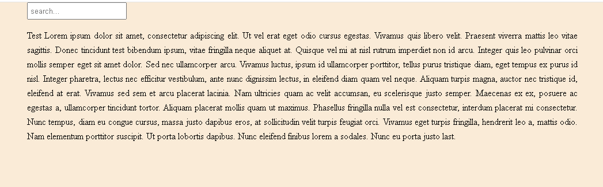

# Text Search & Highlight

A simple text search application built with **HTML**, **CSS**, and **JavaScript**. The application allows users to search within a paragraph, highlights the first matching result, and displays its position.

## Preview

<p align="center">
  
</p>

## Features

* Live text search
* Highlight the first matching result
* Display the position of the matched text
* Case-insensitive search
* Show a message when no match is found
* Simple and responsive interface

## Technologies Used

* HTML5
* CSS3
* JavaScript (ES6)

## Project Structure

```text
javascript-text-search/
│── index.html
│── style.css
│── README.md
└── images/
    └── Screenshot.png
```

## How to Run

1. Clone or download this repository.
2. Open `index.html` in your browser.

## Learning Purpose

This project was built to practice:

* DOM Manipulation
* Event Handling
* String Methods
* Dynamic HTML Rendering
* Search Algorithms
* Text Highlighting

## Future Improvements

* Highlight all matching results instead of only the first
* Support regular expressions
* Add search navigation (Next / Previous)
* Display the total number of matches
* Add a clear search button

## Author

Created by **Setareh Kazemi**
